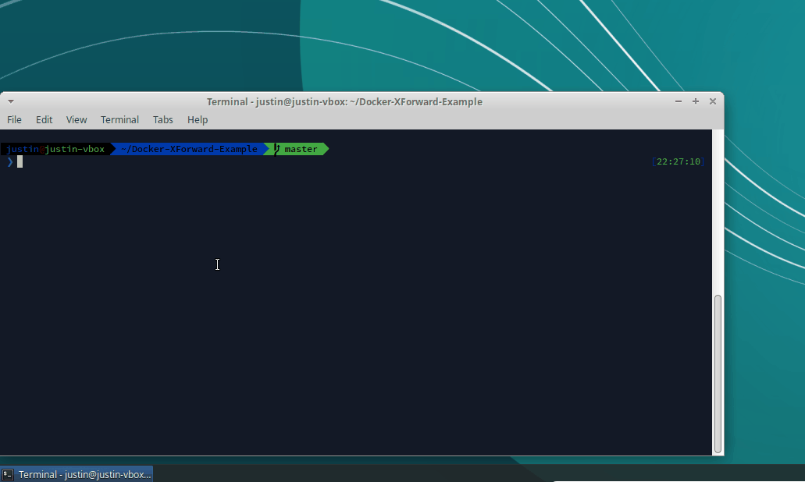

# GUI Apps in Docker

A very simple example of how to run GUI apps in Docker using X forwarding.

## What you need to know

* To try it, clone and run `bin/demo xeyes` (Requires Docker and you must be using Xorg display server).
* The relevant files for understanding how X forwarding is achieved are `Dockerfile`, `entrypoint.sh`, and `bin/demo`.
* The `.tasks` folder is used for a build and release pipeline with Travis CI. Ignore this folder unless you want to learn about creating CI/CD pipelines with Docker.

## Known Limitation

Your working directory must be inside the host user's home directory.  Running outside in a directory higher than that will result in failure.
